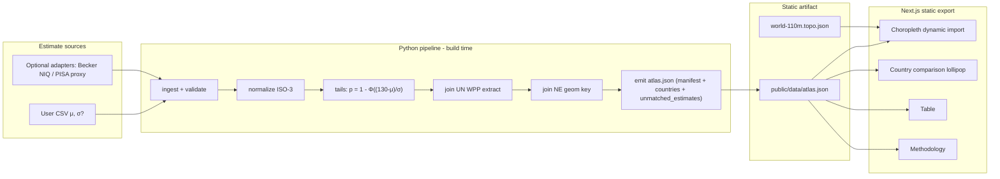
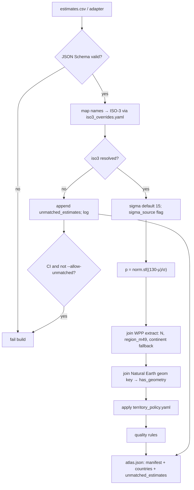
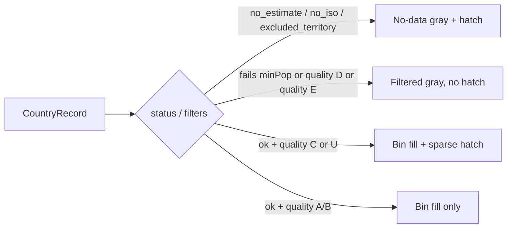
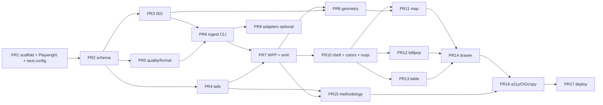

# High-Tail Atlas: Country-Level Estimates of the Population Share Modeled at IQ ≥ 130

| Field | Value |
|---|---|
| **Document title** | High-Tail Atlas — Design Document |
| **Product name** | High-Tail Atlas |
| **Author** | Engineering placeholder — set `authors` in `CITATION.cff` at first commit |
| **Date** | 2026-08-25 |
| **Revised** | 2026-08-25 (open questions signed off) |
| **Status** | Approved |
| **Audience** | Senior engineers implementing a greenfield static dashboard |
| **Related artifacts** | This document only (no existing application) |

---

## Overview

This document specifies a small, standalone web dashboard whose **single primary metric** is the estimated percentage of each country’s population modeled to have IQ ≥ 130. The product is **not** a ranking of “national intelligence.” Country IQ means are treated as **estimates with uncertainty**, often derived from sparse and methodologically contested compilations. The dashboard makes provenance, sample quality, and model assumptions first-class, and it derives the headline number from a documented normal right-tail formula rather than from a census count of high-IQ people.

The recommended implementation is a **static-first** Next.js App Router application (`output: "export"`). A Python pipeline ingests a versioned estimates file (user-supplied CSV by default; optional adapters for public compilations), normalizes ISO 3166-1 alpha-3 codes, computes \(p = 1 - \Phi((130 - \mu) / \sigma)\), joins UN World Population Prospects headcounts, and emits a single `atlas.json` the client fetches from `/data/atlas.json`. The UI is three coordinated views of that artifact: a choropleth, a country-comparison lollipop, and a sortable table, plus a persistently visible methodology surface.

---

## Background & Motivation

### What the user asked for

A world dashboard of “global IQ by country” where **the only metric that matters** is the share of each country’s population above IQ 130. Secondary figures (country mean, population, estimated headcount above 130) may appear as context. They must not compete as KPIs.

### Why this is a model, not a measurement

IQ 130 is conventionally two standard deviations above a mean of 100 with SD 15. Under a standard normal,

\[
P(X \ge 130 \mid \mu = 100, \sigma = 15) = 1 - \Phi(2) \approx 0.02275013 \approx 2.28\%.
\]

Display constant (do not mix 2.28 / 2.275 / 2.3 in UI chrome):

```ts
export const REFERENCE_P = 0.02275;       // proportion; axis / bin math
export const REFERENCE_P_LABEL = "2.28%"; // legend, reference-line label, methodology
```

Quality-A **cell** formatting of this value is `2.3%` (one decimal). The legend and methodology keep the conventional `2.28%` string. Never write `2.275%` in the UI.

No country runs a census of IQ. Published “national IQ” figures are **compiled estimates** of a location parameter \(\mu\) (and almost never of \(\sigma\)). The product therefore **computes** a modeled tail probability from \((\mu, \sigma)\) and multiplies by a population estimate. That is a parametric model sitting on top of a noisy, often non-representative measurement process. The UI must say so in every chart title, tooltip, and CSV header.

### Why the source data is a first-class risk

Compilations associated with Lynn & Vanhanen, later Becker “NIQ” updates, World Population Review re-publishings, and similar tables are scientifically controversial. Documented problems include:

- Convenience samples, children-only samples, clinical or selected samples treated as national.
- Neighbor-country imputation for countries with no test data.
- Opaque inclusion/exclusion of studies; evidence of systematic downward bias for some regions (Wicherts et al. 2010; Sear 2022).
- Mixed instruments, Flynn-effect adjustments, and non-comparable test norms.
- Active misuse in “race science” and immigration-restriction propaganda (EHBEA statement; Retraction Watch coverage of subsequent retractions).

A dashboard that charts these numbers without provenance, quality flags, and caveats **is** a ranking of “national intelligence,” regardless of the author’s intent. The design treats that as a product requirement to prevent, not a documentation footnote.

### Current state

This is a **greenfield** product. There is no existing app, schema, or pipeline in the workspace. The design must be implementable as a small standalone repository.

### Pain points the design must absorb

| Pain | Design response |
|---|---|
| Users will read a choropleth as “smarter / dumber countries” | Copy, titles, color scale, and no-trophy ranking chrome |
| \(\mu\) is an estimate; \(\sigma\) is usually assumed | Formula + \(\sigma\) source flag on every row |
| Datasets will be swapped, versioned, and contested | Data contract + `atlas.json` fetched as a static asset; charts read the contract |
| Missing countries, Kosovo/Taiwan/Palestine, tiny states | Explicit ISO join policy; never impute from neighbors |
| Over-precision (2.275013%) and under-precision (0.0% for tiny tails) | Quality-dependent rounding with a floor (`<0.1%` / `<1%`) |

---

## Goals & Non-Goals

### Goals

1. Ship a static web dashboard with three views of **one** primary metric: estimated \(P(\mathrm{IQ} \ge 130)\).
2. Derive that metric from \(1 - \Phi((130 - \mu) / \sigma)\) with default \(\sigma = 15\), and label the result as a **model output**.
3. Join estimates to standard country geometry and population on **ISO 3166-1 alpha-3**.
4. Make **source, year, sample quality, and confidence flag** visible in map tooltips, the table, and a country detail drawer.
5. Surface methodology and dataset limitations in the default UI (banner + methodology page), not only in a footer.
6. Allow swapping the underlying estimates file without rewriting visualization components (replace `public/data/atlas.json` and redeploy static assets; JS bundle need not change if the Zod schema still parses).
7. Support filters: UN region/continent, minimum population, data-quality threshold.
8. Provide a documented ingest path for a user-supplied CSV of \((\mathrm{iso3}, \mu, \sigma?)\).
9. Use language, visual hierarchy, and color that resist “leaderboard of intelligence” framing and racist misuse.
10. On the shipped demo artifact, default filters must color **at least one** country (Playwright).

### Non-goals

- Measuring anyone’s IQ; collecting individual scores; storing PII.
- Producing a new psychometric meta-analysis or endorsing Lynn/Becker/Rindermann estimates.
- Ranking countries by mean IQ, GDP, PISA, or “human capital.”
- Subnational maps, city maps, or racial/ethnic breakdowns **inside** countries.
- Interactive what-if modeling as a primary surface (a methodology sandbox is allowed; it is not the homepage).
- User accounts, comments, or social features.
- Real-time data, APIs for third-party consumers in v1 (a static JSON file is the interface).
- 3D globes, extruded choropleths, or tile-based slippy maps in v1.
- Neighbor-based imputation of missing \(\mu\).
- Mobile-native apps.
- Age-standardizing \(\hat{n}\) onto ages 16+ (v1 applies \(\hat{p}\) to total WPP population and discloses it).
- Dark theme (light theme only in v1; hatch/bin colors are specified for light).
- Heavier-tailed models (t, mixtures) in v1.

---

## Proposed Design

### Product framing

| Do | Do not |
|---|---|
| Product title: **High-Tail Atlas** | “World IQ Rankings”, “Smartest Countries” |
| Chart titles: “Estimated share of population modeled at IQ ≥ 130” | “National intelligence”, “IQ leaderboard” |
| Visible heading for the lollipop: **“Country comparison (lollipop)”** | Visible heading “Ranked lollipop” / “Top 40” |
| Every number prefixed by “estimate” / “modeled” | Present \(p\) as a measured rate |
| Sortable table as a **data explorer** | Podium, medals, flag-size-by-score |
| Default sort: **population descending**, shared with the lollipop via `nuqs` | Default landing sort by \(p\) descending on first paint |
| CSV download: `high-tail-atlas-estimates.csv` | `iq-rankings.csv` or similar |

**First-paint layout:** methodology banner (non-dismissible on first visit; thereafter collapsible but not hidden from the layout) → filters → map (primary visual) → lollipop + table as equal secondary panes → footnotes with dataset version.

### Recommended stack (pinned for implementability)

Greenfield standalone repo, Node 22 LTS, Python 3.12 for the pipeline.

| Layer | Choice | Version / pin | Role |
|---|---|---|---|
| Framework | **Next.js App Router** | `next@16.3.3` | Static export; contains current RCE fixes as of 2026-08-25 |
| UI runtime | **React** | `react@19` (what `next@16.3.3` installs) | Client islands for map/chart/table |
| Language | **TypeScript** | `typescript@5.8` | App + shared types |
| Styling | **Tailwind CSS** + **shadcn/ui** | Tailwind 4.x, shadcn (Radix primitives) | Layout, filters, drawer, table chrome |
| Mapping | **@visx/geo** + **@visx/zoom** + **topojson-client** | `@visx/geo@^4`, `@visx/zoom@^4`, `topojson-client@3` | SVG choropleth + in-SVG pan/zoom; visx v4 is the React 18/19 line |
| Geometry | Natural Earth Admin 0, 1:110m, as TopoJSON | NE 5.1.1 (or 6.x if released stable) | Country polygons |
| Charts | **recharts** | `recharts@3.10.1` | Horizontal lollipop (ComposedChart) |
| Table | **@tanstack/react-table** | v8.21 | Sort, filter, virtualize |
| Schema | **zod** | v3.24+ | Runtime validation of the artifact |
| URL state | **nuqs** | v2 | Client-only filter/sort query string via `NuqsAdapter` |
| CSV (browser) | **papaparse** | v5 | Optional in-browser preview of a user CSV |
| Pipeline | **Python 3.12** | `pandas`, `scipy`, `jsonschema`, `pyyaml`, `pycountry` | Ingest → tails → join → emit |
| Optional columnar | **pyarrow** | latest 19.x | Emit Parquet alongside JSON |
| Unit tests | **vitest** (TS), **pytest** (pipeline) | — | Formula, join, rounding, far-tail `erfc` |
| E2E | **Playwright** | latest 1.x, added in PR 1 | Filters, a11y, caveat presence, demo map not empty |
| Package manager | **pnpm** | 10.x | Lockfile |

**Why this mapping library.** A country choropleth of ~200 polygons does not need MapLibre, Mapbox, or vector tiles. `@visx/geo` v4 is React 19-compatible, uses `d3-geo`, renders SVG (printable, CSS-styleable, easier keyboard/screen-reader hooks), and has no per-load tile cost. Equal Earth is a **built-in visx preset**: `<Mercator />` is not used; use `<Graticule />` plus visx `projection="equalEarth"` (from `d3-geo`, **not** `d3-geo-projection`). `react-simple-maps` is an acceptable substitute if the implementer wants more opinionated geography components; it is the same `d3-geo` stack. MapLibre GL JS 6.x is reserved as a **v2** option if we add tiled basemaps or subnational layers.

**Why Recharts not Observable Plot.** Lollipops are slightly more natural in Plot (`rule` + `dot`), but Recharts 3.10.1 is the engine behind shadcn charts, has first-class React + TypeScript, and keeps one visualization runtime for the team. Plot remains the listed alternative.

**Why Python for the pipeline.** Tail probabilities at \(z \ge 3\) (low \(\mu\)) need a real survival function (`scipy.stats.norm.sf`). Pandas is the least-error-prone way to join ISO quirks. The dashboard never recomputes tails except in an optional methodology sandbox.

**Static export (required `next.config.ts` keys):**

```ts
import type { NextConfig } from "next";

// Single source of truth: CI sets NEXT_PUBLIC_BASE_PATH=/high-tail-atlas for project pages.
// next.config.ts basePath does NOT invent that env var on its own.
const basePath = process.env.NEXT_PUBLIC_BASE_PATH || "";

const nextConfig: NextConfig = {
  output: "export",
  trailingSlash: true,           // GitHub Pages
  images: { unoptimized: true }, // no default next/image optimizer under export
  ...(basePath ? { basePath } : {}),
};

export default nextConfig;
```

The site is a folder of HTML/JS/JSON deployable to GitHub Pages, Cloudflare Pages, S3, or Vercel. No server, no database, no request-time `ImageResponse`, no server `searchParams` loaders. `NuqsAdapter` from `nuqs/adapters/next/app` wraps the root layout; all `nuqs` parsers are **client-only** (`shallow: true` default). GitHub Pages cannot set `X-Robots-Tag` per query string — see robots policy under Rollout.

The choropleth is a `next/dynamic` client import so the map library is not in the first JS payload.

### Repository layout

```
high-tail-atlas/
  README.md
  LICENSE
  CITATION.cff                     # software citation template (not a national-IQ paper)
  AGENTS.md
  data/
    raw/                           # git-lfs or not committed if license-encumbered
      README.md
    overrides/
      iso3_overrides.yaml
      territory_policy.yaml
    schemas/
      estimates.schema.json        # input CSV/JSON
      atlas.schema.json            # pipeline output (AtlasFile)
      iso3_overrides.schema.json
      territory_policy.schema.json
      wpp_extract.schema.json
    fixtures/
      demo_estimates.csv           # fabricated μ; quality C; labeled DEMO
      expected_atlas_min.json      # golden tests
  pipeline/
    pyproject.toml                 # pandas, scipy, jsonschema, pyyaml, pycountry, pyarrow
    src/hightail/
      ingest.py
      normalize.py
      tails.py
      join.py
      emit.py
      quality.py
      cli.py
    scripts/
      fetch_wpp.py                 # pin DESA URL + SHA256; emit WPP extract
    tests/
  web/
    package.json                   # includes playwright, @visx/geo@^4, @visx/zoom@^4, recharts@3.10.1
    next.config.ts
    playwright.config.ts
    src/
      app/
        layout.tsx                 # NuqsAdapter + CaveatBanner
        page.tsx                   # RSC shell; dashboard is a client island
        methodology/page.tsx
        data/page.tsx
        about/page.tsx
      components/
        CaveatBanner.tsx
        FilterBar.tsx
        ChoroplethMap.tsx          # next/dynamic import from the dashboard client
        LollipopChart.tsx          # visible title: Country comparison (lollipop)
        CountryTable.tsx
        CountryDrawer.tsx
        ColorLegend.tsx
        FormulaBlock.tsx
      lib/
        types.ts
        schema.ts                  # zod, generated from / kept in sync with atlas.schema.json
        format.ts                  # quality-dependent rounding; golden-tested
        filters.ts
        colors.ts                  # bins + REFERENCE_P; shared by map and lollipop
        tails.ts                   # normSf / tailP
        erfc.ts                    # vendored Cephes-style erfc; no extra npm erfc dep
        pct.ts                     # pPct(pHat) = 100 * pHat; never bind p_hat to a % axis
    public/                        # sibling of src/ — NOT src/public (Next.js 404s that)
      robots.txt
      og.png                       # checked-in static OG image WITH caveat banner
      data/
        atlas.json                 # build output; fetched at runtime; do not hand-edit
        atlas.parquet              # optional
        world-110m.topo.json
  .github/workflows/
    ci.yml                         # single workflow that grows (pytest, vitest, playwright, build)
```

**Do not put `public/` inside `src/`.** Next.js App Router with `web/src/app/` serves static files from `web/public/` (sibling of `src/`, `package.json`, and `next.config.ts`). `web/src/public/data/atlas.json` is not a URL and will 404. The pipeline CLI `--out web/public/data/atlas.json` is the same directory the client fetches.

`CITATION.cff` template at first commit:

```yaml
cff-version: 1.2.0
title: High-Tail Atlas
message: Cite this software and its dataset_id, not a national-IQ compilation.
type: software
authors:
  - family-names: TBD
    given-names: TBD
date-released: "2026-08-25"
license: MIT
repository-code: TBD
```

### System architecture



### Runtime data flow (browser)

```mermaid
sequenceDiagram
  participant Page as Dashboard (RSC shell)
  participant Client as DashboardClient
  participant Atlas as GET /data/atlas.json
  participant Store as nuqs (client-only)
  participant Map as Choropleth
  participant Chart as Lollipop
  participant Table as Table
  participant Drawer as Country drawer

  Page->>Client: render client island
  Client->>Atlas: fetch static asset
  Atlas-->>Client: AtlasFile (Zod parse)
  Client->>Store: default filters (quality threshold C, minPop 250k)
  Note over Store: C includes A, B, C, and U; excludes D and E
  Store->>Map: filtered rows
  Store->>Chart: filtered rows
  Store->>Table: filtered rows
  Map->>Drawer: click iso3
  Chart->>Drawer: click iso3
  Table->>Drawer: click row
  Drawer-->>Drawer: show μ, σ, formula, source, quality, band
```

`layout.tsx` must wrap children with `NuqsAdapter` from `nuqs/adapters/next/app`. Do not read `searchParams` in the RSC page for filters — under `output: "export"` those are empty.

### Primary metric and formula

Let \(T = 130\) (fixed product constant).

\[
z_i = \frac{T - \mu_i}{\sigma_i}, \qquad
\hat{p}_i = 1 - \Phi(z_i) = \texttt{scipy.stats.norm.sf}(z_i)
\]

\[
\hat{n}_i = \mathrm{round}(\hat{p}_i \cdot N_i)
\]

where \(N_i\) is UN WPP mid-year population for the chosen reference year (integer persons).

**Storage vs display.** `p_hat` is stored in \([0,1]\). Percent axes, reference lines, and tick formatters bind **only** to `pPct(p_hat)`:

```ts
/** Proportion [0,1] → percentage points. The only mapping allowed onto a % axis. */
export function pPct(pHat: number): number {
  return 100 * pHat;
}
```

There is **no** `p_pct` / `p_hat_pct` float on `CountryRecord`. CSV export writes `p_hat_display` as the **formatted string** from `format.ts` (e.g. `"2.3%"`, `"<0.1%"`, `"~2%"`), plus optional raw `p_hat` in a clearly named `p_hat_proportion` column for reproducibility.

**Defaults**

| Parameter | Default | Rule |
|---|---|---|
| \(T\) | 130 | Product constant; not user-editable on the dashboard |
| \(\sigma_i\) | 15 | Used when the source has no country-specific SD; set `sigma_source = "assumed_15"` |
| Country-specific \(\sigma\) | Pass through if \(\sigma \in (5, 30)\); else fail ingest | Values in (5, 12] ∪ [20, 30) pass and set `sigma_flag = "outside_12_20"` |
| \(\Phi\) | Standard normal CDF | Documented; **not** a t-distribution, **not** a mixture |
| Rounding of \(\hat{p}\) for display | Quality-dependent with floors | See Display rules |
| Rounding of \(\hat{n}\) | Nearest integer, with `"<1"` if \(\hat{n} < 1\) after round | Headcount is an order-of-magnitude context number |

**Worked examples** (\(\sigma = 15\), \(T = 130\)). Display columns are **quality A** after `format.ts`. Drawer extra digits apply **only if** \(q < 0.1\); otherwise drawer **equals** map/table. One-decimal percents use **half-up** on the first unused digit (`Math.round(q * 10) / 10` for \(q \ge 0.1\)): 0.135% → `0.1%`, 0.383% → `0.4%`, 0.9815% → `1.0%`, 2.275% → `2.3%`. Do not use banker's rounding.

| \(\mu\) | \(z\) | \(\hat{p}\) (proportion) | \(\hat{p}\) as % | Quality A map/table | Quality A drawer |
|---|---|---|---|---|---|
| 70 | 4.000 | 3.167e-05 | 0.003167% | `<0.1%` | 0.0032% (2 sig figs) |
| 85 | 3.000 | 1.350e-03 | 0.1350% | 0.1% | 0.1% |
| 90 | 2.667 | 3.830e-03 | 0.3830% | 0.4% | 0.4% |
| 95 | 2.333 | 9.815e-03 | 0.9815% | 1.0% | 1.0% |
| 100 | 2.000 | 2.275e-02 | 2.275% | 2.3% | 2.3% |
| 105 | 1.667 | 4.779e-02 | 4.779% | 4.8% | 4.8% |
| 108 | 1.467 | 7.12e-02 | 7.12% | 7.1% | 7.1% |
| 110 | 1.333 | 9.12e-02 | 9.12% | 9.1% | 9.1% |

Pipeline golden tests must lock \(\hat{p}(\mu=100,\sigma=15)\) to `0.022750131948179195` within \(10^{-12}\) against `scipy.stats.norm.sf(2)`.

TypeScript `normSf` is golden-tested against the same scipy values at \(z \in \{2, 3, 4\}\) within \(10^{-12}\) (far tail is where a bad `erfc` fails). Pin: **vendored Cephes-style `erfc` in `web/src/lib/erfc.ts`** (no `math-erfc` / `ml.js` dependency). Python remains the publisher of `p_hat`; TS is for the methodology calculator and browser CSV preview.

**Assumptions (must appear on `/methodology` and in `atlas.json` `manifest.assumptions`):**

1. IQ in each country is i.i.d. \(\mathcal{N}(\mu_i, \sigma_i^2)\). Real distributions are discrete, bounded, and often skewed; the far tail is the part of a normal that is **least** credible.
2. Tests, if any, are interval-scaled on the same metric as “IQ points.”
3. \(\mu_i\) is an unbiased estimate of the **current national resident** mean. Most sources fail this (children, convenience, old tests, Flynn drift, urban samples).
4. \(\sigma_i = 15\) unless published. Between-country variance of SDs is ignored. If true \(\sigma_i > 15\), \(\hat{p}_i\) is understated for \(\mu_i < 130\); if \(\sigma_i < 15\), overstated.
5. Independence from age structure. Applying \(\hat{p}\) to total population (including infants) is a **modeling convenience**, not a claim that toddlers have IQ scores. The methodology page must say this; v1 does not age-standardize.
6. No correction for restriction of range, test ceiling, or Flynn effect inside this pipeline. If the source already adjusted, that belongs in provenance, not a second adjustment.

**Sensitivity band vs SE interval (not interchangeable).**

If the source does **not** provide \(\mathrm{SE}(\mu)\), compute an **illustrative** band with \(\delta = 3\) IQ points:

\[
\hat{p}_i^{\mathrm{lo,pm3}} = 1 - \Phi((T - (\mu_i - \delta)) / \sigma_i), \quad
\hat{p}_i^{\mathrm{hi,pm3}} = 1 - \Phi((T - (\mu_i + \delta)) / \sigma_i)
\]

\(\delta = 3\) is **illustrative ~0.2σ** under the default \(\sigma = 15\) (\(3/15 = 0.2\)). It is not a standard error, not one source SD, and not a confidence interval. Methodology copy: “Sensitivity to ±3 IQ points in the assumed mean (~0.2σ if σ=15) — **not** a statistical confidence interval.”

Always store `p_lo_pm3` / `p_hi_pm3` when `p_hat` is non-null.

If the source **does** provide `mu_se`, also compute

\[
\hat{p}_i^{\mathrm{lo,se}} = 1 - \Phi((T - (\mu_i - 1.96\,\mathrm{SE})) / \sigma_i), \quad
\hat{p}_i^{\mathrm{hi,se}} = 1 - \Phi((T - (\mu_i + 1.96\,\mathrm{SE})) / \sigma_i)
\]

and store `p_lo_se` / `p_hi_se`. Label: “interval from reported SE of the mean, still conditional on normality and σ.”

**Drawer band rule:** if `p_lo_se` is non-null, show the SE band as the primary range. The ±3 band is available behind a “model sensitivity” disclosure, never drawn beside the SE band unlabeled. If `p_lo_se` is null, show only the ±3 band. **Never** put either band on the choropleth fill.

Do not draw error bars that look like CIs on the map.

### Data pipeline



Unmatched rows are **not** `CountryRecord`s. They never get a fake ISO-3. CI fails if `unmatched_estimates.length > 0` unless `--allow-unmatched` (local debugging only). Silent drops are forbidden.

**CLI**

```text
python -m hightail.cli build \
  --estimates data/raw/estimates.csv \
  --population data/raw/wpp_extract.csv \
  --geometry-index data/raw/ne_110m_iso3.csv \
  --overrides data/overrides/iso3_overrides.yaml \
  --policy data/overrides/territory_policy.yaml \
  --schema data/schemas/estimates.schema.json \
  --out web/public/data/atlas.json \
  --parquet web/public/data/atlas.parquet \
  --reference-year 2025
```

`--manifest` is **not** a separate output. `atlas.json` embeds the full manifest. A human-readable pretty-print of `manifest` is shown on `/data`.

Run this in CI and as a `prebuild` script of the web package (`pnpm pipeline && next build`). The web app **never** reads `estimates.csv` directly.

**Ingest rules**

1. UTF-8 CSV with header row. Extra columns are preserved in `source_extra` (JSON object) if they do not collide.
2. Required columns: `iso3` **or** `name`, and `mu`.
3. Optional: `sigma`, `source`, `source_url`, `source_year`, `sample_n`, `sample_type`, `quality`, `mu_se`, `notes`.
4. One row per ISO-3. Duplicates fail the build unless `--on-duplicate=error|first|mean` is set; default `error`.
5. `mu` must be in \((50, 130)\). Values outside fail unless `--allow-extreme-mu` (still flagged `quality = E`).
6. `sigma` must be in \((5, 30)\) if present. Inside (5, 30) but outside [12, 20]: allowed, `sigma_flag = "outside_12_20"`.
7. **Never impute \(\mu\) from neighbors.** Countries in the geometry/pop frame with no estimate row → `status = "no_estimate"`, `quality = null`, `mu = null`, `p_hat = null`.
8. **Empty / whitespace CSV cells are omitted** before Zod (Pandas/Papa `""` is not an omitted key). After that, optional URL fields use `emptyToUndef`. A row with `source_url,,` is valid.

#### ISO overrides schema (`data/schemas/iso3_overrides.schema.json`)

`data/overrides/iso3_overrides.yaml` is the only place name/code exceptions live. PRs that add aliases must cite ISO or UN M49.

```yaml
# iso3_overrides.yaml
version: 1
# source token (name, ISO-2, or non-canonical ISO-3) → canonical ISO-3
aliases:
  "South Korea": KOR
  "Korea, Republic of": KOR
  "Czech Republic": CZE
  "Czechia": CZE
  "Cape Verde": CPV
  "Swaziland": SWZ
  "Eswatini": SWZ
  "Turkey": TUR
  "Türkiye": TUR
  "Ivory Coast": CIV
  "Cote d'Ivoire": CIV
  "DRC": COD
  "Congo, Democratic Republic of the": COD
  "Republic of the Congo": COG
  XKX: XKX
  KOS: XKX
  ROM: ROU
  NAM: NAM
# names that must fail closed rather than guess
never_map:
  - Congo          # COD vs COG
  - Korea          # KOR vs PRK
  - Guinea         # GIN vs GNQ vs GNB
# ISO-2 handled by pycountry except:
iso2_overrides:
  NA: NAM          # Namibia; pycountry may treat NA as missing/NaN
```

Join key is **ISO 3166-1 alpha-3**, uppercase. ISO-2 maps through `pycountry.countries.get(alpha_2=...)` then `iso2_overrides`; fail if ambiguous.

| Case | Policy |
|---|---|
| Standard ISO-3 | Use as-is |
| ISO-2 only | `pycountry` then `iso2_overrides`; fail if ambiguous |
| Names only | `aliases`; if in `never_map`, unmatched |
| Kosovo | Internal `XKX`. NE `KOS` or `-99` mapped via aliases when it is Kosovo |
| Taiwan | `TWN`. Do not fold into `CHN` |
| Palestine | `PSE` |
| Namibia | `NAM` |
| Romania | `ROU` not `ROM` |
| Natural Earth `ISO_A3 = -99` | If `ADM0_A3` matches `^[A-Z0-9]{3}$`: `iso3 = ADM0_A3`, `status = "no_iso"`, `has_geometry = true`. Else omit the feature from `countries` (do **not** put it in `unmatched_estimates`), increment CI-only `n_geometry_dropped`, **fail the build if that count > 0**. |
| France / Norway / US / UK overseas | Admin 0 countries. Do not spread `FRA` μ onto `GUF`/`REU`/`NCL` |
| Disputed polygons | No μ **inheritance**. A **direct** estimate row for that `iso3`/`ADM0_A3` is `status = "ok"`. See territory policy. |

#### Territory policy schema (`data/schemas/territory_policy.schema.json`)

```yaml
# territory_policy.yaml
version: 1
geometry_viewpoint: natural_earth_de_facto   # signed off for v1; not a national POV file
inherit_mu_to_disputed: false                # MUST remain false
omit_from_choropleth:
  - ATA
excluded_territory_iso3: []                  # optional hard-hide list
# Features that must not inherit a sovereign μ. Direct estimate rows still win.
disputed_no_estimate_adm0_a3:
  - B57    # example placeholder; fill from NE 5.1.1 disputed/breakaway join at implement
  - KAS
  - CYN
  - SAH
notes: >
  Natural Earth de facto Admin 0. Disputed / breakaway polygons do not
  inherit a sovereign μ. A BYO row whose iso3/ADM0_A3 matches the feature
  is status=ok. Tooltip "Not independently estimated" only when there is
  no matching estimate row.
```

`disputed_no_estimate_adm0_a3` is filled in PR 3/8 from the actual NE 5.1.1 attribute table (not guessed). Policy file + test: `inherit_mu_to_disputed === false`.

**Direct estimate vs inheritance**

| Situation | `status` | Map fill | Tooltip |
|---|---|---|---|
| Disputed/breakaway feature, **no** matching estimate row | `no_estimate` (or `no_iso` if `ISO_A3 = -99`) | No-data gray + hatch | “Not independently estimated” |
| Disputed/breakaway feature, **direct** CSV/adapter row for that `iso3` / `ADM0_A3` | `ok` | Data bin (C/U still hatched) | Normal estimate tooltip |
| Feature would only get μ by copying a sovereign (e.g. `FRA` → `GUF`, `MAR` → `SAH`) | never | — | Inheritance is forbidden |
| `excluded_territory_iso3` (optional hard-hide) | `excluded_territory` | No-data gray + hatch | Hidden by territory policy |

#### WPP extract contract

Do **not** join the raw UN DESA bulk file in the dashboard pipeline. `pipeline/scripts/fetch_wpp.py` downloads a **pinned** WPP 2024 Compact CSV, verifies SHA-256, converts units, and writes `data/raw/wpp_extract.csv` matching `data/schemas/wpp_extract.schema.json`.

Raw DESA columns (WPP 2024 demographic indicators / total population files): `ISO3_code`, `LocID`, `Location`, `Time`, `Variant`, `PopTotal` where `PopTotal` is **thousands of persons**.

Extract columns (one row per ISO-3, reference year):

```csv
iso3,name,population,pop_year,variant,region_m49,continent
USA,United States of America,347275807,2025,Medium,Northern America,Americas
```

| Field | Type | Rule |
|---|---|---|
| `iso3` | 3-letter | From `ISO3_code`; skip aggregates with blank ISO3 |
| `name` | string | WPP `Location` |
| `population` | int | `round(PopTotal * 1000)` — **persons**, not thousands |
| `pop_year` | int | `--reference-year` (default 2025) |
| `variant` | string | `Medium` only |
| `region_m49` | string | UN M49 region name (from WPP regional classification join on `LocID`) |
| `continent` | string | Africa / Americas / Asia / Europe / Oceania (mapped from M49) |

`fetch_wpp.py` pins:

- Source page: https://population.un.org/wpp/assets/ (WPP 2024 CSV bulk)
- Exact filename + SHA-256 recorded in `data/raw/WPP_PIN.txt`
- Citation: United Nations, DESA/Population Division (2024). *World Population Prospects 2024*.

If the DESA URL moves, the script fails closed on hash mismatch. Our World in Data’s processed WPP 2024 file is an **allowed fallback** if DESA is unreachable, still emitting the same extract schema and citing both.

**Display-name and region winner rule** (applied in `join.py`):

| Field | Winner |
|---|---|
| `name` | estimates CSV `name` if non-empty, else Natural Earth `NAME_EN` (fallback `NAME`), else WPP `name` |
| `region_m49` | WPP extract `region_m49`; if null, NE `REGION_UN` |
| `continent` | NE `CONTINENT` if `has_geometry`, else WPP `continent` |

**Population join**

- `estimated_n_ge_130 = round(p_hat * population)` stored as integer; raw `p_hat` kept for recomputation.
- Countries in WPP but not in the map: table only, `has_geometry = false`.
- Countries in the map but not in WPP: `population = null`, exclude from headcount sums, still mappable.

**Tiny populations**

Default filter `min_population = 250_000`. Rows below the threshold remain in the artifact with `tiny_population = true`. They do not color the map under default filters (fill = filtered-out, distinct from no-data). The table can reveal them when the user lowers the threshold. Rationale: a 0.1 percentage-point change on Nauru is tens of people and is visually equal to a 0.1 point change on Indonesia if the map is unweighted.

**Missing countries / union frame**

The `countries` array is the **union** of (a) Natural Earth 110m features we keep (including `no_iso` / excluded), (b) WPP territories with ISO-3, (c) **matched** estimate rows. Status on `CountryRecord`:

```text
ok | no_estimate | no_iso | excluded_territory
```

`unmatched_estimates` is a sibling array, not a status. Estimate rows that cannot be mapped never enter `countries`.

### Dataset strategy

National-IQ compilations are not treated as a default bundled fact table.

**Tier 0 — operational default (ship this)**

User-supplied CSV matching `estimates.schema.json`. The README’s “bring your own estimates” path is the supported production mode.

**Tier 1 — demo fixture (ship this, labeled)**

`data/fixtures/demo_estimates.csv`:

- **Fabricated** \(\mu\) only, and only from the set \(\{90, 100, 110\}\) so the numbers cannot be mistaken for Becker/Lynn values.
- `source = "DEMO_FIXTURE"`, `source_year = 2026`, `sample_type = convenience`, **`quality = "C"`**.
- Quality **D is not used for demo rows.** D remains “neighbor-imputed / undocumented re-publish.”
- At least **15 ISO-3 codes with WPP population ≥ 1 million** (must include `USA, CHN, IND, BRA, NGA, PAK, IDN, BGD, RUS, MEX, JPN, ETH, PHL, EGY, DEU`) so the default `min_population = 250_000` plus quality threshold C still fills the map.
- Manifest `dataset_id` starts with `demo-`. `flags.demo_badge = true`.
- UI: red/amber **DEMO DATA** badge on every view, keyed off `dataset_id` prefix / `flags.demo_badge`.

Playwright on `/`: with default filters, **≥ 1** country polygon has a data-bin fill (not no-data, not filtered-gray).

**Tier 2 — post-v1 adapters only, after legal review; never vendored in git**

| Candidate | What it actually is | Adapter policy |
|---|---|---|
| Becker NIQ / viewoniq.org (Lynn lineage) | Compiled test means + quality fields; scientifically contested | **Not v1.** Adapter code may be sketched under `pipeline/src/hightail/adapters/becker.py` only **after license review**. **Do not commit the raw table.** Neighbor-imputed rows → `quality = D`, `sample_type = imputed`, dropped from default filters. Cite Sear (2022), Wicherts et al. (2010), EHBEA if ever used |
| World Population Review “IQ by country” pages | Unsourced re-publish | **Do not adapter** |
| Rindermann / PISA–TIMSS conversions | Scholastic achievement, not IQ | Optional `adapters/pisa.py` **relabels** `manifest.metric_label` away from “IQ ≥ 130”. Do not silently relabel PISA as IQ |
| Direct psychometric publications | Highest quality, sparse | `quality = A` only if adult, nationally representative, n ≥ 1,000, documented sampling |

**Quality enum (assigned by source metadata, not by \(\mu\))**

| Code | Meaning | Default map inclusion | Hatch |
|---|---|---|---|
| **A** | Nationally representative adult sample, n ≥ 1,000, documented frame, test named, year known | Yes | No |
| **B** | Large sample but incomplete frame (urban only, students only, n ≥ 300) | Yes | No |
| **C** | Convenience, children-only, clinical, n < 300 with a real in-country sample, **or demo fixture** | Yes | Sparse hatch |
| **D** | Neighbor-imputed, regional average, or undocumented secondary re-publish | **No** | n/a (filtered) |
| **E** | Extreme / failed validation / incompatible instrument | **Never** via the threshold; map = filtered-gray; omit from lollipop/table | none (filtered-gray, not hatch) |
| **U** | Unknown — source did not provide enough to classify | **Same as C** (included at threshold C) | Same as C (sparse hatch) |
| **`null`** | No estimate on this country row (`status ≠ ok`) | No (no-data) | No-data hatch |

`assign_quality()` can only **downgrade**, never upgrade, a source-provided flag.

**`sample_type` controlled vocabulary** (required for `assign_quality`; not a free string):

```ts
export const SampleType = z.enum([
  "adult_representative",
  "students",
  "children",
  "urban",
  "clinical",
  "convenience",
  "imputed",
  "unknown",
]);
```

Default mapping when the source does not supply `quality`:

| `sample_type` | n | → quality |
|---|---|---|
| `adult_representative` | ≥ 1,000 | A (also requires year + named source) |
| `adult_representative` | < 1,000 | B if n ≥ 300 else C |
| `students` or `urban` | ≥ 300 | B |
| `children`, `clinical`, `convenience` | any | C |
| `imputed` | any | D |
| `unknown` | any | U |

**Versioning / single manifest**

The app reads **one** file: `atlas.json`. `manifest` is a strict superset of what used to be `dataset_manifest.json`. `schema_version` starts at `1`.

### Visualizations

#### 1. Choropleth world map

**Encoding**

- Geography: Natural Earth 110m. Projection: visx **`projection="equalEarth"`** (built-in; equal-area). Not Web Mercator. Not `d3-geo-projection`.
- Fill: **binned sequential** scale of \(\hat{p}\).
- Stroke: 0.5px neutral (`#4b5563` at 40% on light theme).
- No-data (`no_estimate` / `no_iso` / `excluded_territory`): `#d1d5db` + 45° hatch. Never interpolate a color.
- Filtered-out (fails min-pop or quality): `#e5e7eb` **without** hatch.
- Quality C **and U** (included): bin fill + sparse hatch. Tooltip prefix “low sample quality” (C) or “unknown sample quality” (U).
- Interaction: hover tooltip; click opens drawer; keyboard via the table (canonical a11y path).
- Zoom: `@visx/zoom` in-SVG pan/zoom enough to reach Caribbean and Pacific. Reset button.
- Antarctica (`ATA`): omit from the choropleth (`omit_from_choropleth`).
- Code-split: `next/dynamic(() => import("./ChoroplethMap"), { ssr: false })`.

**Color scale (default)**

Fixed percentage bins. Not data quantiles.

Lightest ColorBrewer BuPu (`#edf8fb`) is **not used** — too low-contrast on white. First data bin starts at BuPu-6 `#bfd3e6`. Every legend swatch has a 1px `#6b7280` border.

| Bin | Fill | Legend label |
|---|---|---|
| no data | `#d1d5db` + hatch | No estimate |
| filtered | `#e5e7eb` | Hidden by filters |
| \(p < 0.5\%\) | `#bfd3e6` | < 0.5% |
| 0.5 – 1.5% | `#9ebcda` | 0.5–1.5% |
| 1.5 – 2.5% | `#8c96c6` | 1.5–2.5% (includes `REFERENCE_P_LABEL`) |
| 2.5 – 4.5% | `#8856a7` | 2.5–4.5% |
| ≥ 4.5% | `#810f7c` | ≥ 4.5% |

Legend caption: **“Modeled share of population at IQ ≥ 130 (normal tail). Bins are coarse on purpose.”** Tick labeled “μ=100, σ=15 → 2.28%.”

A “continuous” toggle is allowed in an **advanced** menu; quantized to 0.5 percentage points; off by default (`flags.show_continuous_scale`).

**Do not** size countries by \(\hat{p}\) or \(\hat{n}\) (cartogram).

**Tooltip (hover)**

```
{country name}
Estimated share modeled at IQ ≥ 130: {formatted p from format.ts}
This is a model output, not a count.
Quality: {A–E, U, or “no estimate”} · Source year: {year or “unknown”}
Source: {short}
{if quality C/D/U: quality caveat}
```

#### 2. Country comparison (lollipop)

Visible UI title: **“Country comparison (lollipop)”** — not “Ranked lollipop chart.”

Horizontal lollipop, one row per filtered country.

- X: `pPct(p_hat)` (percentage points). Axis title **“Estimated % of population modeled at IQ ≥ 130”**. Domain in percent, e.g. `[0, dataMax]`.
- Y: `name`. Sort is **shared** with the table via `nuqs` key `sort` (`population` default, or `p_hat`, or `name`).
- Stem: 2px gray line from 0 to `pPct(p_hat)`. Head: circle, same bin color as the map, radius 5.
- Reference line at `pPct(REFERENCE_P)` i.e. **2.275** on a percent axis, labeled `REFERENCE_P_LABEL` (`"2.28%"`).
- Quality C and U: hollow circle. Quality D (only if user includes them): dotted stem.
- Cap: **40 countries in the current sort** (default sort: largest populations). Label exactly: “40 countries in current sort (default: largest populations).” Not “top 40.” Control: “Show all N countries.” Full set lives in the table.
- When `sort=p_hat` descending, the caveat banner remains visible; DEMO/estimate watermark stays in any screenshot path.
- Tooltip: same copy as the map; `estimated_n_ge_130` as context only.
- No medals. Table “row #” is “row # in current sort,” not “IQ rank.”

View-model (never bind `p_hat` to the percent axis):

```tsx
const rows = countries.map((c) => ({
  ...c,
  p_pct: c.p_hat == null ? null : pPct(c.p_hat),
}));

<ComposedChart layout="vertical" data={rows} margin={{ left: 120, right: 24 }}>
  <XAxis type="number" domain={[0, "dataMax"]}
         tickFormatter={(v) => `${v}%`}
         label={{ value: "Estimated % modeled at IQ ≥ 130", position: "bottom" }} />
  <YAxis type="category" dataKey="name" width={110} />
  <ReferenceLine x={pPct(REFERENCE_P)} strokeDasharray="4 4"
                 label={REFERENCE_P_LABEL} />
  <Bar dataKey="p_pct" barSize={2} />
  <Scatter dataKey="p_pct" />
  <Tooltip content={<EstimateTooltip />} />
</ComposedChart>
```

#### 3. Sortable table

Columns (v1):

| Column | Field | Notes |
|---|---|---|
| Country | `name` | Link opens drawer |
| ISO-3 | `iso3` | Monospace |
| Estimated % ≥ 130 | `p_hat` via `formatPHat(p_hat, quality)` | Primary metric; never raw float |
| Est. people ≥ 130 | `estimated_n_ge_130` | Context; `~` prefix; null if no pop |
| Population | `population` | UN WPP, year in header (`pop_year`) |
| Quality | `quality` | Badge A–E / U / — |
| Source year | `source_year` | |
| Source | `source_short` | Footnote id |
| σ | `sigma` | “15 (assumed)” vs “12.4 (source)” |

Default sort: population descending, **same `nuqs` `sort` param as the lollipop**. Sticky header. Virtualize once \(n > 80\).

CSV download of the **filtered** view:

- Filename: **`high-tail-atlas-estimates.csv`**
- Header comments:

```text
# Modeled estimates, not measurements. p = 1 - Phi((130-mu)/sigma). Dataset {dataset_id}.
# p_hat_display is a formatted string from the quality policy; p_hat_proportion is in [0,1].
```

- Columns include `p_hat_display` (from `format.ts`) and `p_hat_proportion` (raw). Do not add a second float named `p_hat_pct`.

### Filters

All filters are URL-serialised with **client-only** `nuqs` so a view is pasteable. No server parsers.

| Filter | Control | Default | Effect |
|---|---|---|---|
| Continent | Multi-select of `unique(continent)` from the artifact | All (empty selection) | exact `continent` |
| M49 region | Multi-select of `unique(region_m49)` from the artifact | All (empty selection) | exact `region_m49` |
| Min population | Numeric + presets (0 / 250k / 1M / 10M) | 250,000 | `population >= min`; null pop excluded |
| Quality | Inclusive threshold A / B / C / D | **C** | See below |
| Search | Typeahead name / ISO | Empty | Table + highlight on map |
| Sort | `population` \| `p_hat` \| `name` | `population` | Shared table + lollipop |

**Place predicate** (`web/src/lib/filters.ts`). Two independent controls; empty list means “no constraint.” They **AND**:

```ts
export function matchesPlace(
  row: CountryRecord,
  continents: string[],
  regions: string[],
): boolean {
  const continentOk =
    continents.length === 0 ||
    (row.continent != null && continents.includes(row.continent));
  const regionOk =
    regions.length === 0 ||
    (row.region_m49 != null && regions.includes(row.region_m49));
  return continentOk && regionOk;
}
```

Do **not** implement a single widget whose options mix “Africa” with “Eastern Africa” under one `region_m49 ∈ selected` test — that matches nothing. `nuqs` keys: `continent` (array) and `region` (array).

**Quality threshold semantics.** The control is an inclusive ceiling on the A≻B≻C≻D chain. It is **not** “quality ≥ C” in any numeric sense.

| Threshold selected | Included | Excluded |
|---|---|---|
| A | A only | B, C, D, E, U, null |
| B | A, B | C, D, E, U, null |
| C (default) | A, B, C, **U** | D, E, null |
| D | A, B, C, U, D | E, null |

- **U ≡ C** for inclusion and for hatch.
- **E is never included** by moving the threshold. Treat **E like D for chrome**: `status` may be `ok` (e.g. `--allow-extreme-mu`), but E is omitted from lollipop and table, and the choropleth uses **filtered-gray** (no hatch) — not a data-bin fill, not no-data hatch. E still appears in the `/data` pipeline report. Do not drop E from `countries` (geometry must still render).
- `null` quality (no estimate) is no-data, not a quality miss.

`flags.allow_quality_d` defaults `false` and only changes whether D is offered in the control, not demo behavior. Demo uses C and does not need this flag.

Status line: “Showing 142 of 201 countries with estimates; 46 no estimate; 13 hidden by filters.”

### Country detail drawer

Opened from any view. Contents, in order:

1. Country name + ISO-3.
2. **Estimated share modeled at IQ ≥ 130:** `formatPHat` plus the band per the drawer band rule (SE if present, else ±3).
3. Formula with **this country’s** numbers, computed from `tailP` — never a transcribed constant. Spec example for tests/docs only: μ=100, σ=15 → `1 − Φ((130 − 100) / 15) = 2.28%`. (μ=98 is **not** 2.28%; do not hard-code that.)
4. Context only: μ, σ (and whether assumed), `sigma_flag`, population, \(\hat{n}\).
5. Provenance card: source, year, sample n, sample type, quality flag, link, notes.
6. “What this is not”: two-sentence block (not a census; not a ranking of worth).

### Methodology page (`/methodology`) and in-app panel

Always linked from the banner. Must include:

1. The formula, `REFERENCE_P_LABEL`, and a small interactive calculator (μ, σ sliders) using TS `tailP` / vendored `erfc`.
2. Assumption list from this document.
3. Why \(\sigma = 15\) is an assumption; pass-through window (5, 30).
4. Why normality is worst in the tail; why v1 does not use t / mixtures.
5. Why age structure is ignored in v1.
6. Why \(\delta = 3\) (~0.2σ) is illustrative sensitivity, not a CI.
7. Dataset limitations: sampling, Flynn effect, cultural loading, neighbor imputation (refused).
8. Ethical note: documented misuse; no “dumbest countries” view; no racial breakdowns.
9. Pretty-printed `manifest` from `atlas.json`.
10. How to replace the estimates file.

**Caveat banner copy (required, not lorem):**

> These figures are **modeled estimates**, not measurements. Each percentage is the right tail of a normal distribution given a published or assumed country mean and SD (default 15), applied to UN population counts. National IQ compilations are incomplete and contested. This is **not** a ranking of people, nations, or worth. Read the methodology.

### Display and language rules

Implemented in `web/src/lib/format.ts`. No component invents precision. Golden-tested in vitest **and** pytest (pipeline may emit a `p_hat_display` only in CSV via the same rules documented here; the web formatter is canonical for UI).

Let \(q = 100 \times \hat{p}\) (percentage points). One-decimal rounding is **half-up**: `Math.round(q * 10) / 10` (not banker's). PR 5 golden-tests the worked-example table; map/table and drawer columns **must match** whenever \(q \ge 0.1\).

| Quality | Map and table | Drawer (same, plus extra only under the floor) |
|---|---|---|
| A | If \(q \ge 0.1\): one decimal (`2.3%`, `0.1%`). If \(q < 0.1\): `"<0.1%"` | If \(q < 0.1\): two significant digits (`0.0032%`); **else same string as map/table** |
| B | Same as A with a leading tilde (`~2.3%`, `~<0.1%`) | Same |
| C and U | If \(q \ge 1\): `"~N%"` with 0 decimals (`~2%`). If \(q < 1\): `"<1%"` | Same |
| D | Map: “Insufficient data.” Table (only if user included D): muted `"~N%"` / `"<1%"` using the C rule | “Insufficient data” + muted number |
| E | Map: filtered-gray (no %). Not in table/lollipop | `/data` report only; drawer if reached via map: “Failed validation (quality E)” |
| null | No-data hatch (no %) | “No estimate” |

Never use “IQ rank.” Never use gold/silver/bronze. Page `<title>` and OG tags: “High-Tail Atlas — modeled estimates of the population share at IQ ≥ 130” plus “estimates, not measurements.”

### Color, projection, and “no data” states (summary)



---

## API / Interface Changes

There is no existing API. v1 public interface is **files**, not HTTP services.

### Input contract — `estimates.schema.json` / CSV

```csv
iso3,name,mu,sigma,mu_se,source,source_url,source_year,sample_n,sample_type,quality,notes
USA,United States,110.0,15.0,,DEMO_FIXTURE,,2026,1,convenience,C,FABRICATED for UI
```

```ts
export const Quality = z.enum(["A", "B", "C", "D", "E", "U"]);
export const SampleType = z.enum([
  "adult_representative",
  "students",
  "children",
  "urban",
  "clinical",
  "convenience",
  "imputed",
  "unknown",
]);

const emptyToUndef = z.literal("").transform(() => undefined);

export const EstimateRow = z.object({
  iso3: z.string().length(3).regex(/^[A-Z]{3}$/).optional(),
  name: z.string().min(1).optional(),
  mu: z.number().gt(50).lt(130),
  sigma: z.number().gt(5).lt(30).optional(),
  mu_se: z.number().nonnegative().optional(),
  source: z.string().optional(),
  source_url: z.string().url().optional().or(emptyToUndef),
  source_year: z.number().int().gte(1900).lte(2026).optional(),
  sample_n: z.number().int().positive().optional(),
  sample_type: SampleType.optional(),
  quality: Quality.optional(),
  notes: z.string().optional().or(emptyToUndef),
}).refine((r) => r.iso3 || r.name, { message: "iso3 or name required" });
```

### Output contract — `atlas.json` (`AtlasFile`)

```ts
export const CountryRecord = z.object({
  iso3: z.string().regex(/^[A-Z0-9]{3}$/),
  name: z.string(),
  continent: z.string().nullable(),
  region_m49: z.string().nullable(),
  mu: z.number().nullable(),
  sigma: z.number().nullable(),
  sigma_source: z.enum(["source", "assumed_15"]).nullable(),
  sigma_flag: z.enum(["outside_12_20"]).nullable(),
  mu_se: z.number().nullable(),
  p_hat: z.number().min(0).max(1).nullable(),
  p_lo_pm3: z.number().min(0).max(1).nullable(),
  p_hi_pm3: z.number().min(0).max(1).nullable(),
  p_lo_se: z.number().min(0).max(1).nullable(),
  p_hi_se: z.number().min(0).max(1).nullable(),
  population: z.number().int().nonnegative().nullable(),
  pop_year: z.number().int().nullable(),
  estimated_n_ge_130: z.number().int().nonnegative().nullable(),
  quality: Quality.nullable(),           // null iff status !== "ok"
  source: z.string().nullable(),
  source_short: z.string().nullable(),
  source_url: z.string().nullable(),
  source_year: z.number().int().nullable(),
  sample_n: z.number().int().nullable(),
  sample_type: SampleType.nullable(),
  notes: z.string().nullable(),
  status: z.enum(["ok", "no_estimate", "no_iso", "excluded_territory"]),
  has_geometry: z.boolean(),
  tiny_population: z.boolean(),
});

export const UnmatchedEstimate = z.object({
  raw_name: z.string().nullable(),
  raw_iso3: z.string().nullable(),
  mu: z.number(),
  reason: z.enum(["unmapped_name", "invalid_iso3", "ambiguous_name", "never_map"]),
});

export const AtlasManifest = z.object({
  schema_version: z.literal(1),
  dataset_id: z.string(),
  created_at: z.string().datetime(),
  pipeline_version: z.string(),
  threshold_iq: z.literal(130),
  default_sigma: z.literal(15),
  formula: z.literal("p = 1 - Phi((130 - mu) / sigma)"),
  phi_implementation: z.literal("scipy.stats.norm.sf"),
  metric_label: z.string(), // "Estimated share modeled at IQ ≥ 130" or PISA relabel
  population_source: z.string(),
  geometry_source: z.string(),
  estimates_source: z.object({
    name: z.string(),
    citation: z.string().nullable(),
    url: z.string().nullable(),
    license: z.string().nullable(),
  }),
  caveats_hash: z.string(),
  n_ok: z.number().int(),
  n_no_estimate: z.number().int(),
  n_no_iso: z.number().int(),
  n_excluded_territory: z.number().int(),
  n_unmatched: z.number().int(),
  n_quality: z.record(Quality, z.number().int()),
  flags: z.object({
    show_continuous_scale: z.boolean(),
    allow_quality_d: z.boolean(),
    demo_badge: z.boolean(),
  }),
  assumptions: z.array(z.string()),
});

export const AtlasFile = z.object({
  manifest: AtlasManifest,
  countries: z.array(CountryRecord),
  unmatched_estimates: z.array(UnmatchedEstimate),
});
```

Invariant: `quality` is null ⇔ `status !== "ok"`. `p_lo_se`/`p_hi_se` are null ⇔ `mu_se` is null. `p_hat` null ⇔ `status !== "ok"`.

### Client data access (not a module import from `public/`)

`web/public/` is a URL tree, not a TypeScript module path. The dashboard **fetches** the artifact so operators can swap `atlas.json` without a JS rebuild.

`next.config.ts` `basePath` does **not** populate `NEXT_PUBLIC_BASE_PATH`. Use **one** env var for both, or a root-relative URL built from `window.location.origin` plus that same value:

```ts
// next.config.ts — single source of truth for project-pages deploys
const basePath = process.env.NEXT_PUBLIC_BASE_PATH || ""; // e.g. "/high-tail-atlas"
const nextConfig: NextConfig = {
  output: "export",
  trailingSlash: true,
  images: { unoptimized: true },
  ...(basePath ? { basePath } : {}),
};

// client island — never fetch("/data/atlas.json") (ignores basePath)
function atlasHref(): string {
  const prefix = process.env.NEXT_PUBLIC_BASE_PATH || "";
  return new URL(
    "data/atlas.json",
    `${window.location.origin}${prefix.endsWith("/") ? prefix : prefix + "/"}`,
  ).toString();
}

const res = await fetch(atlasHref(), { cache: "no-store" });
const data = AtlasFile.parse(await res.json());
```

On a custom domain, leave `NEXT_PUBLIC_BASE_PATH` unset so the URL is `{origin}/data/atlas.json`. CI for GitHub project pages must set `NEXT_PUBLIC_BASE_PATH=/high-tail-atlas` for **both** `next build` and the client bundle. Playwright: serve exported `out/` at `/` and at `/high-tail-atlas/` and assert `atlas.json` returns **200**; also assert `out/data/atlas.json` exists on disk.

Swapping datasets = replace `web/public/data/atlas.json` (and TopoJSON if geometry version changes) and redeploy static files. No chart component imports a source-specific column name beyond this schema.

### Optional in-browser CSV preview (not a second pipeline)

`/data` may allow drag-drop of a CSV, parse with Papa Parse, run TS `tailP` for preview only, watermark “browser preview — not the published artifact.” Publishing still requires the Python pipeline.

```ts
/** Survival function of N(0,1): 1 - Φ(z) = 0.5 * erfc(z / √2). erfc from ./erfc (Cephes). */
export function normSf(z: number): number {
  return 0.5 * erfc(z / Math.SQRT2);
}

export function tailP(mu: number, sigma: number, threshold = 130): number {
  return normSf((threshold - mu) / sigma);
}
```

Vitest: `|normSf(z) - scipy_sf(z)| < 1e-12` for `z ∈ {2, 3, 4}`.

### Routes

| Path | Type | Purpose |
|---|---|---|
| `/` | RSC shell + client island | Dashboard (fetch atlas.json in the island) |
| `/methodology` | RSC + small client calculator | Formula, caveats, citations |
| `/data` | RSC + optional client preview | Manifest, download, CSV schema |
| `/about` | RSC | Ethics, what we will not build |

No REST API in v1. No request-time OG route.

---

## Data Model Changes

Greenfield: the model **is** `AtlasFile` (`manifest` + `countries` + `unmatched_estimates`).

### Storage

| Artifact | Format | Typical size | Git |
|---|---|---|---|
| `atlas.json` | JSON `AtlasFile` | 80–200 KB | Committed after review **if** demo; user datasets uncommitted |
| `atlas.parquet` | PyArrow of `countries` only | ~20–40 KB | Optional CI artifact |
| `world-110m.topo.json` | TopoJSON | ~100–250 KB | Committed (public domain NE) |
| `wpp_extract.csv` | CSV per schema | ~50 KB | Committed with UN citation + `WPP_PIN.txt` |
| Raw Becker/Lynn tables | CSV | — | **Not in git** without a LICENSE decision |
| `og.png` | PNG with caveat banner | < 500 KB | Committed |

### Migration strategy

`schema_version: 1` on `manifest`. Additive fields bump `pipeline_version` minor; Zod is strict (no `.passthrough()` in production). Breaking renames bump `schema_version`; old `atlas.json` fails parse on purpose.

There is no database migration.

### Geometry join

TopoJSON feature properties must include `ISO_A3` and `ADM0_A3`. At build, `join.py` asserts every `has_geometry: true` row’s `iso3` exists in the TopoJSON (ISO_A3 or ADM0_A3).

**`ISO_A3 ∈ {-99, null, ""}` rule (canonical — do not invent `X-` prefixes):**

1. If `ADM0_A3` matches `^[A-Z0-9]{3}$`: emit a `CountryRecord` with `iso3 = ADM0_A3`, `status = "no_iso"`, `has_geometry = true`, `quality = null`.
2. Else: **omit** the feature from `countries`. Do not put it in `unmatched_estimates` (that array is for estimate rows). Increment CI-only `n_geometry_dropped`.
3. **Fail the build if `n_geometry_dropped > 0`**, so a new Natural Earth version cannot silently eat a polygon.

`iso3` on `CountryRecord` is `/^[A-Z0-9]{3}$/` (ISO-3 or NE `ADM0_A3`), not strictly ISO.

---

## Alternatives Considered

### A. MapLibre GL JS choropleth on vector tiles

**Pros:** Smooth pan/zoom, future subnational layers, 2026-standard “real map.” `maplibre-gl@6.6` is mature.  
**Cons:** Tile style hosting (or self-hosted PMTiles), heavier bundle, WebGL a11y and print are worse, overkill for ~200 admin-0 polygons.  
**Decision:** Reject for v1; revisit if we leave admin-0.

### B. Observable Plot for both map and lollipop

**Pros:** Excellent lollipops; concise grammar.  
**Cons:** Not React-native (imperative `Plot.plot`); SSR/hydration friction in App Router; choropleth stories are less documented than visx/d3-geo in React.  
**Decision:** Recharts 3.10.1 + visx v4. Plot is the escape hatch for the methodology notebook if we add one.

### C. Bundle Becker NIQ as the default dataset

**Pros:** Instant “complete” world map; matches user expectation of a populated choropleth.  
**Cons:** Launders a contested, racially misused compilation into a polished UI; default filters cannot fully undo the framing. EHBEA and Sear argue the table is not fit for purpose.  
**Decision:** **Do not bundle.** Demo fixture + BYO CSV. Optional adapter with mandatory quality downgrade of imputed rows.

### D. Use PISA 2022 as the default μ proxy

**Pros:** Transparent sampling, OECD documentation, yearly-ish updates.  
**Cons:** It is not IQ; converting to IQ-like units (Rindermann-style) reintroduces the very overclaim we are trying to avoid; coverage is not global.  
**Decision:** Optional adapter that **relabels the product metric** away from IQ. Not the default.

### E. Live server / database (PostGIS, API)

**Pros:** Dynamic uploads, multi-user datasets.  
**Cons:** Ops cost, auth, threat surface, pointless for ~200 rows that change yearly.  
**Decision:** Static artifact. A future “dataset switcher” is still just multiple JSON files.

### F. Continuous color scale (viridis)

**Pros:** Familiar “science” look; resolves small differences.  
**Cons:** Precisely the over-precision problem; viridis implies a laboratory measurement. Small μ errors move colors a lot in the tail because \(\hat{p}\) is convex in μ near 100.  
**Decision:** Fixed, coarse sequential bins.

### G. Age-standardize the headcount (apply \(\hat{p}\) only to ages 16+)

**Pros:** More honest about what IQ tests measure.  
**Cons:** Extra WPP age-structure join; still a model.  
**Decision:** **Not v1.** Methodology discloses that \(\hat{n}\) uses total population. Revisit as v1.1 after the demo dashboard ships.

### H. t-distribution or mixture tails instead of \(\mathcal{N}(\mu,\sigma^2)\)

**Pros:** The product’s own assumptions say the far tail is the least credible part of a normal; a heavier tail would raise \(\hat{p}\) for a given \(\mu\).  
**Cons:** A second degrees-of-freedom or mixture-weight parameter is **unidentifiable** from the published country means. Shipping it would look like a more sophisticated measurement while adding untestable knobs — worse overclaim than a documented normal.  
**Decision:** **Reject for v1.** Keep the normal, document it, and let the methodology calculator stay on \(\Phi\). Do not add a “robust tail” toggle.

---

## Security & Privacy Considerations

### Threat model

| Threat | Severity | Mitigation |
|---|---|---|
| Product used as a “scientific” prop for racist ranking of nations / immigrants | **High** | Framing, no racial/ethnic splits, no neighbor imputation, caveats on every view, refuse “lowest IQ countries” posters (watermark DEMO or “estimate”) |
| Over-precise numbers quoted out of context | **High** | Rounding floors, binned color, CSV header disclaimer |
| SEO / social cards as “dumbest countries 2026” | **High** | Controlled `<title>`, OG PNG with banner, **`robots.txt` Disallow on demo deploys**; never per-country vanity routes like `/country/dumbest`; GitHub Pages cannot noindex a single query string |
| Disputed-border political incidents | **Medium** | Natural Earth de facto + explicit no-inheritance; about page cites NE disputed-boundaries policy |
| Supply-chain / malicious CSV in CI | **Low–medium** | Schema validation; no eval; build fails on unmatched or extreme μ |
| XSS via source `notes` or country names | **Medium** | React text escaping; sanitize URLs with an allow-list (`https:`) |
| PII | **None expected** | No individual data; reject CSVs with person-level rows (n of file > 400 countries fails; columns named `age`, `sex`, `race` at person grain fail ingest) |
| User upload malware | **Low** | v1 upload is local preview only; no server store |

### AuthN / AuthZ

None. The site is public and static. If a lab later hosts a private estimates file, that is a hosting concern (basic auth / VPN), not an application concern.

### Data handling

- Do not log ISO-3 clickstreams in a form that reconstructs a “user’s favorite ranking.”
- Do not add third-party analytics that scrape country names into advertising profiles. If analytics exist, privacy-preserving (e.g. server logs of page hits only, or none).
- Licenses: Natural Earth public domain; UN WPP has reuse terms that require citation; contested IQ tables may not be redistributable — adapters must check before emit-to-`public/`.

### Ethical misuse — required mitigations (product, not just docs)

1. **Visible uncertainty** on every tooltip and table cell (quality badge + estimate language).
2. **No “leaderboard of intelligence” framing** — copy review in PR checklist. Visible UI must not say “ranked,” “top 40,” or “leaderboard.”
3. **Source footnotes** on table and drawer.
4. The word **estimate** or **modeled** in every chart title.
5. Default quality filter **excludes imputed rows (D)** and never includes E.
6. Refuse a feature request for race, religion, or immigrant-origin choropleths in this codebase (document in `AGENTS.md` and `/about`).
7. Checked-in `public/og.png` includes the caveat banner, not a naked map.

---

## Observability

Static site: no request-time service. Observability is **build-time** and **client-error**.

### Pipeline logs / metrics (CI)

`atlas.json` `manifest` plus CI-only `pipeline_report.json` (not served):

| Metric | Alert |
|---|---|
| `n_ok`, `n_no_estimate`, `n_unmatched` | Fail if `n_unmatched > 0` in CI |
| `n_quality[A..E,U]` | Warn if A+B = 0 and dataset is not `demo-*` |
| `p_hat` range, median | Fail if any `p_hat` ∉ [0, 1] or median p_hat > 0.25 (likely μ/σ units error) |
| `sum(estimated_n_ge_130)` | Informational; do not present as “world gifted population” in UI |
| Golden `norm.sf` at z=2,3,4 (Python and TS) | Fail on mismatch > 1e-12 |
| `format.ts` golden table (map/table = drawer when \(q \ge 0.1\)) | Fail on mismatch |
| Schema validation | Fail build |
| `n_geometry_dropped` | Fail if > 0 |
| Demo Playwright: ≥1 filled country at defaults | Fail |
| Playwright: `out/data/atlas.json` 200 (with and without `basePath`) | Fail |

### Client

- `web-vitals` optional; not required for v1.
- `window.addEventListener("error")` is enough; no PII.
- Accessibility: axe in Playwright on `/`, `/methodology`.
- Visual regression (optional Playwright screenshots) of the map legend and banner.

### Alerting

GitHub Actions failure on `main` is the alert. No on-call.

---

## Rollout Plan

### Feature flags

v1 is a static binary of features, stored on `manifest.flags`:

```json
{ "show_continuous_scale": false, "allow_quality_d": false, "demo_badge": true }
```

### Robots / indexing (closes former Q2)

GitHub Pages **cannot** set `X-Robots-Tag` per query string. Policy:

- **Demo deploy** (`dataset_id` starts with `demo-` / `flags.demo_badge`): `public/robots.txt` is `User-agent: *\nDisallow: /` and every page sets `<meta name="robots" content="noindex,nofollow">`.
- **Non-demo public deploy:** index `/` and `/methodology`; still no per-sort noindex. Do not promise query-level robots on GH Pages.

### Staged rollout

1. **Internal**: demo fixture only; engineers dogfood copy. Default filters **must** fill the map.
2. **Private preview**: a lab’s own CSV; methodology review by someone who did not write the pipeline.
3. **Public**: demo (noindex) or an explicitly cited dataset with the adapter’s quality mapping; `about` + `methodology` linked from every page.

### Rollback

Previous `atlas.json` + previous `web` deploy (static hosting versioning). Pipeline and web are independently revertable if `schema_version` did not break.

### Performance budgets (quantified)

| Item | Target | Notes |
|---|---|---|
| `atlas.json` | < 250 KB uncompressed | Hard |
| TopoJSON 110m | < 300 KB uncompressed | Hard |
| First load JS (gzip), map excluded | < 250 KB | Stretch. Map is `next/dynamic` |
| First load JS (gzip), including map | < 400 KB | Committed budget for Next 16 + React 19 + visx + Recharts + TanStack |
| Map interactive | < 200 countries at 60fps hover on a mid-tier laptop | |
| LCP | < 2.5 s on broadband | |
| Pipeline runtime | < 30 s on GitHub-hosted runner | |

No backend latency. Filter operations are in-memory \(O(n)\) over \(n \approx 250\).

---

## Key Decisions

| Decision | Choice | Rationale |
|---|---|---|
| Primary metric | Single: modeled \(P(\mathrm{IQ} \ge 130)\) | User scope; prevents KPI soup and mean-IQ leaderboards |
| Computation | `scipy.stats.norm.sf((130-μ)/σ)`, default σ=15 | Standard definition of IQ 130; reproducible tails |
| Heavier tails (t / mixture) | **Not v1** | Second parameter is unidentifiable; would overclaim (Alt. H) |
| Architecture | Static Next.js export; fetch `data/atlas.json` via `origin + NEXT_PUBLIC_BASE_PATH` | `next.config` `basePath` does not set that env by itself; swapping JSON must not require a JS rebuild |
| Static files | `web/public/` sibling of `web/src/` | `src/public/` 404s under App Router |
| URL state | Client-only `nuqs` + `NuqsAdapter`; no RSC `searchParams` | `output: "export"` has empty server searchParams |
| Stack | Next **16.3.3**, TS, **@visx/geo@^4** + **@visx/zoom@^4**, **recharts@3.10.1**, TanStack Table 8, Python 3.12 + `pycountry` | visx v3.12 does not support React 19; Equal Earth is a visx preset |
| Product name | **High-Tail Atlas** (official) | Signed off; avoids “IQ Rankings” / “national intelligence” |
| v1 estimates provider | **Demo only.** Labeled DEMO fixture (quality C, μ ∈ {90, 100, 110}). No real national-IQ table in v1. BYO CSV later without rewriting charts | Signed off; charts read `AtlasFile`, not a source |
| Contested NIQ tables (Lynn/Vanhanen, Becker, etc.) | **Not in v1.** Do not vendor in git. Any adapter that ingests a contested compilation needs a **license check** before a public artifact includes it | Signed off; legal review is a gate, not a maybe |
| Default data | Shipped DEMO + BYO CSV path; **do not vendor Lynn/Becker** | Provenance and ethics; matches provider decision |
| Demo quality | **C** (not D), μ ∈ {90,100,110}, ≥15 populous ISO-3s | D means imputed; default threshold C would hide a D-only demo |
| Join key | ISO 3166-1 alpha-3 (NE `ADM0_A3` for no-ISO geometry) | Standard, stable |
| Display name | estimates `name` → NE `NAME_EN` → WPP `Location` | Avoids three different labels for one country |
| Place filters | Two controls: `continent` AND `region_m49` (empty = all) | A single `region_m49 ∈ selected` widget cannot match “Africa” |
| Missing data | No neighbor imputation; unmatched estimates live in a **sibling array**, not `countries` | Schema can represent the union frame |
| Color | Fixed sequential bins; first bin `#bfd3e6` not `#edf8fb` | Avoids false precision and low-contrast legend |
| Ranking chrome | No medals; default **shared** sort by population (`nuqs` `sort`); lollipop title “Country comparison”; CSV `high-tail-atlas-estimates.csv` | Reduces leaderboard reading |
| Uncertainty | Quality flags; ±3 μ (~0.2σ) sensitivity **or** SE band if `mu_se` exists, never both unlabeled | Most sources have no real SE; a choropleth CI would overclaim |
| Age-standardize \(\hat{n}\) | **Not v1**; disclose total-population application | Extra WPP join; still a model |
| Country-specific σ | Pass through \((5,30)\); flag outside [12,20] | Do not silently cap |
| Geometry viewpoint | **Natural Earth de facto** world for v1 (Kosovo / Taiwan / Palestine). Not a national POV file | Signed off |
| Geometry | Natural Earth 110m, `projection="equalEarth"`; `no_iso` uses `ADM0_A3`; `n_geometry_dropped > 0` fails CI | Public domain; de facto borders; no silent polygon drops |
| Disputed polygons | No inherited μ. **Direct** estimate row for that polygon → `ok`; otherwise no-data | Signed off; inheritance ≠ “always no-data” |
| Quality E | Like D on the map (filtered-gray); omit from lollipop/table; keep in `countries` | Threshold never includes E; `--allow-extreme-mu` still has geometry |
| Empty CSV cells | `""` → omit / `emptyToUndef` before URL parse | Papa/Pandas empty is `""`, not `undefined` |
| Percent display | Half-up one decimal; drawer = map/table when \(q \ge 0.1\) | Worked examples and `format.ts` must be one table |
| Population | UN WPP 2024 Medium, mid-year 2025, persons = `PopTotal * 1000` | Pinned extract schema |
| Tiny countries | Default min pop 250k | Tail × tiny N is noise |
| Copy | “Estimate/modeled” in every title; methodology banner | Ethical mitigation |
| Indexing | Demo deploy `noindex` whole site; no per-query GH Pages headers | Hosting constraint |
| Dark theme | **Not v1** | Hatch/bin specified for light only |
| Percent mapping | `pPct(p_hat) = 100 * p_hat` in `pct.ts`; CSV `p_hat_display` is a formatted string | Prevents 0.02275% axis bugs |
| `erfc` | Vendored Cephes in `erfc.ts`; golden vs scipy at z=2,3,4 | Far tail is the product |

---

## Open Questions

**None remaining.** The four must-ask items were signed off 2026-08-25 and moved to Key Decisions. There is no human blocker before implementing PRs 1–17 on the DEMO dataset.

### Decided (traceability — closed)

| Topic | Decision |
|---|---|
| Official product name | **High-Tail Atlas** |
| First real estimates provider | **Demo only for v1.** Quality C; μ ∈ {90, 100, 110}; clearly labeled DEMO. Users may later swap a BYO CSV without rewriting charts. No real national-IQ table in v1 |
| Geometry viewpoint (Kosovo / Taiwan / Palestine) | Natural Earth **de facto** world. Disputed polygons get no inherited μ. A direct estimate row is allowed; otherwise no-data |
| Contested NIQ tables (Lynn/Vanhanen, Becker, etc.) | **Not until legal review.** Demo + BYO CSV only. Do not vendor those tables in git. Any adapter that ingests a contested compilation needs a license check before a public artifact includes it |
| Indexing / former Q2 | Demo: sitewide noindex + `robots.txt` Disallow. Non-demo: index `/` and `/methodology`. No per-query headers on GitHub Pages |
| Age-standardize \(\hat{n}\) / former Q3 | Not v1 |
| Country-specific σ / former Q4 | Pass through (5, 30); flag outside [12, 20] |
| Shared sort / former Q7 | One `nuqs` `sort` key for table + lollipop; default `population` |
| Dark theme / former Q8 | Not v1 (non-goal) |
| Demo quality | C, not D |

---

## Risks

| Risk | Severity | Mitigation |
|---|---|---|
| Racist or nationalist misuse of screenshots | High | Framing, watermark, refuse race splits, coarse bins, methodology on first paint |
| Scientific overclaim (normal tail as census) | High | Formula in drawer from `tailP`; “model not count” in tooltips; quality badges |
| Shipping demo μ that journalists treat as real | High | Persistent DEMO badge; μ only in {90,100,110}; quality C so the map **does** show, which makes the badge mandatory |
| Empty first paint | High (was) | Demo quality C + ≥15 populous countries; Playwright ≥1 filled polygon |
| ISO join silent drop of a populous country | Medium | CI fail on unmatched; coverage test: `USA,CHN,IND,IDN,PAK,NGA,BRA` must be `ok` or explicit `no_estimate` |
| σ=15 false for some countries; tail is sensitive | Medium | `sigma_source` visible; methodology calculator |
| Contested borders | Medium | Territory policy file; no-data fill; cite NE |
| visx + Next client-only hydration mismatch | Low | Map is `"use client"` + `dynamic(..., { ssr: false })`; geometry and atlas fetched as static JSON |
| Recharts lollipop a11y | Low | Table is the accessible counterpart; skip link to table |
| 100× percent-scale bug | Medium | `pPct` helper; no `p_pct` field on the record; formatter tests |
| First-load JS over 250 KB gzip | Low | Stretch budget; committed 400 KB with dynamic map |

---

## References

- Abramowitz, M., & Stegun, I. A. (1964). *Handbook of Mathematical Functions*. (Prefer Cephes/`scipy` `erfc` in practice.)
- EHBEA (2020). Statement on National IQ Datasets. https://www.ehbea.org/pages/national-iq-datasets
- Natural Earth. Admin 0 — Countries; Disputed boundaries policy. https://www.naturalearthdata.com/about/disputed-boundaries-policy/
- OECD. PISA 2022 Results (if PISA adapter is used).
- Sear, R. (2022). ‘National IQ’ datasets do not provide accurate, unbiased or comparable measures of cognitive ability worldwide. https://www.researchgate.net/publication/360665701
- United Nations, DESA/Population Division (2024). *World Population Prospects 2024*. https://population.un.org/wpp/
- visx v4 geo: `projection="equalEarth"` preset. https://airbnb.io/visx
- Wicherts, J. M., Dolan, C. V., & van der Maas, H. L. J. (2010). A systematic literature review of the average IQ of sub-Saharan Africans. *Intelligence*.
- Warne, R. T. (2022 / related reviews). Discussions of Lynn & Becker NIQ construction.
- Retraction Watch (2025). Coverage of retractions tied to national-IQ database use. https://retractionwatch.com/2025/11/25/meet-the-researcher-aiming-to-halt-use-of-fundamentally-flawed-database-linking-iq-and-nationality/
- Next.js App Router docs (v16.3.3), including `output: "export"` and `images.unoptimized`. https://nextjs.org/docs
- nuqs v2 Next.js App adapter. https://nuqs.dev
- ColorBrewer BuPu. https://colorbrewer2.org/
- scipy.stats.norm.sf documentation.

**Prior art (product, not endorsement):** World Population Review “average IQ by country” pages (example of what **not** to clone); Our World in Data’s citation and provenance patterns (example of what **to** clone for population).

---

## PR Plan

Incremental, independently reviewable PRs. **Timebox: ~17 PRs, 1 engineer, ~3–4 weeks** (demo data actually renders by PR 10). **v1 ships the labeled DEMO dataset only** (signed off). Each PR must be mergeable to `main`. CI lives in a **single** `.github/workflows/ci.yml` that grows; do not create a second `pipeline.yml` later.

Playwright is a dependency from **PR 1**. `web/src/lib/colors.ts` lands in **PR 10** so PRs 11–13 stay parallel.

### PR 1 — Repository scaffold and product constraints

- **PR title:** `chore: scaffold monorepo, AGENTS.md, static-export config, and ethical constraints`
- **Files/components affected:** `README.md`, `AGENTS.md`, `LICENSE`, `CITATION.cff` (template), `.gitignore`, `web/package.json` (Next 16.3.3, React 19, TS, Tailwind, **Playwright**, visx v4, recharts@3.10.1), `web/next.config.ts` (`output: "export"`, `trailingSlash: true`, `images.unoptimized: true`, `basePath` from `NEXT_PUBLIC_BASE_PATH`), `web/playwright.config.ts` (smoke placeholder), `pipeline/pyproject.toml` (pandas, scipy, jsonschema, pyyaml, pycountry), `web/src/app/layout.tsx` (placeholder banner; **not** yet NuqsAdapter if nuqs is PR 10), `web/src/app/about/page.tsx`, `web/public/` (empty `robots.txt` stub — **not** `web/src/public/`), `.github/workflows/ci.yml` (install + `pnpm exec tsc --noEmit` stub)
- **Dependencies:** none
- **Description:** Greenfield repo with written constraints (no neighbor imputation, no racial choropleths, no “smartest country” copy). Empty pages already show the caveat banner. README states: do not put `public/` inside `src/`.

### PR 2 — Data contracts (JSON Schema + Zod)

- **PR title:** `feat: define estimates, atlas, WPP extract, and YAML override schemas`
- **Files/components affected:** `data/schemas/{estimates,atlas,iso3_overrides,territory_policy,wpp_extract}.schema.json`, `web/src/lib/types.ts`, `web/src/lib/schema.ts`, `data/fixtures/expected_atlas_min.json` (includes `unmatched_estimates: []`, nullable `quality`, `p_lo_se`)
- **Dependencies:** PR 1
- **Description:** Lock `AtlasFile` / `CountryRecord` / `UnmatchedEstimate` / `AtlasManifest` (`schema_version: 1`). `source_url` accepts `""` via `emptyToUndef`. Vitest parses the mini fixture. No visualizations.

### PR 3 — ISO overrides and territory policy

- **PR title:** `feat: ISO-3 alias table and disputed-territory policy`
- **Files/components affected:** `data/overrides/iso3_overrides.yaml`, `data/overrides/territory_policy.yaml`, `pipeline/src/hightail/normalize.py`, tests for XKX/TWN/PSE/NAM/ROU/`never_map`/NA→NAM
- **Dependencies:** PR 2
- **Description:** Encode join exceptions and `inherit_mu_to_disputed: false`. A **direct** estimate for a disputed `ADM0_A3` is `ok`; inheritance is not. Independently reviewable by someone with geography knowledge. `disputed_no_estimate_adm0_a3` may land as a commented list until PR 8 fills it from NE.

### PR 4 — Tail probability core

- **PR title:** `feat: normal right-tail p(IQ ≥ 130) with far-tail golden tests`
- **Files/components affected:** `pipeline/src/hightail/tails.py`, `pipeline/tests/test_tails.py`, `web/src/lib/erfc.ts`, `web/src/lib/tails.ts`, `web/src/lib/pct.ts`, `web/src/lib/tails.test.ts`
- **Dependencies:** PR 2
- **Description:** scipy `norm.sf`; vendored Cephes `erfc`; `pPct`. Golden: z ∈ {2,3,4} vs scipy within 1e-12. μ=100, σ=15 → 0.022750131948179195. Forbid crude approximations.

### PR 5 — Quality assignment and display rounding

- **PR title:** `feat: quality enum, sample_type, and format.ts floors`
- **Files/components affected:** `pipeline/src/hightail/quality.py`, `web/src/lib/format.ts`, tests for the display table (`<0.1%`, `<1%`, 2.3%)
- **Dependencies:** PR 2
- **Description:** `sample_type` vocabulary; downgrade-only `assign_quality`; U ≡ C for later filters. Formatter golden tests **are** the worked-example table (drawer = map/table when \(q \ge 0.1\); μ=70 drawer `0.0032%`). Half-up `Math.round(q * 10) / 10`.

### PR 6 — Pipeline ingest + validate + CLI dry-run

- **PR title:** `feat: pipeline ingest, schema validation, and CLI dry-run`
- **Files/components affected:** `pipeline/src/hightail/{ingest,cli}.py`, `data/fixtures/demo_estimates.csv` (quality C, μ ∈ {90,100,110}, ≥15 populous ISO-3s), pytest for duplicate-fail, extreme-μ, sample_type enum
- **Dependencies:** PRs 2–5
- **Description:** No WPP join yet. `hightail.cli ingest --dry-run` prints row counts and unmatched names. Empty CSV cells (`""`) omitted before Zod so blank `source_url` does not fail `.url()`. CI grows: `pytest` ingest tests.

### PR 7 — WPP extract, tails, emit without geometry

- **PR title:** `feat: WPP extract join, tail compute, emit atlas.json without geometry`
- **Files/components affected:** `pipeline/scripts/fetch_wpp.py`, `data/raw/wpp_extract.csv` (or a trimmed fixture if the full file is large), `data/raw/WPP_PIN.txt`, `pipeline/src/hightail/{join,emit,tails}.py`, `web/public/data/atlas.json` demo artifact with `has_geometry: false` on every row
- **Dependencies:** PR 6, PR 4, PR 5, PR 3 (name aliases)
- **Description:** Pin DESA URL/hash; unit conversion thousands → persons; name/region precedence; emit `AtlasFile` including `unmatched_estimates` and SE/±3 bands. CI fails on unmatched. Coverage: `USA,CHN,IND,…` present as `ok` or explicit `no_estimate`. **Does not** require TopoJSON.

### PR 8 — Geometry vendoring and `has_geometry` backfill

- **PR title:** `chore: vendor Natural Earth 110m TopoJSON and backfill has_geometry`
- **Files/components affected:** `web/public/data/world-110m.topo.json`, geometry index, `join.py` geom key, `territory_policy.yaml` disputed ADM0_A3 list filled from NE, re-emitted `atlas.json`
- **Dependencies:** PR 3, PR 7
- **Description:** Drop Antarctica from choropleth list. `ISO_A3=-99` → `iso3=ADM0_A3` if `^[A-Z0-9]{3}$`, else omit and **fail CI** on `n_geometry_dropped > 0`. Direct estimate rows on disputed ADM0_A3 stay `ok`. Backfill `has_geometry`. No UI.

### PR 9 — Optional source adapters (no default data)

- **PR title:** `feat: (post-v1, legal-review gate) Becker/PISA adapters without vendoring contested tables`
- **Files/components affected:** `pipeline/src/hightail/adapters/becker.py`, `adapters/pisa.py`, `adapters/README.md` (citation + EHBEA/Sear + license checklist)
- **Dependencies:** PR 6 (input schema); can parallel PR 7–8
- **Description:** **Not v1.** Blocked until legal review of any contested NIQ compilation. If ever unblocked: neighbor-imputed Becker rows forced to quality D / `sample_type=imputed`; PISA adapter sets `manifest.metric_label`; raw source files stay uncommitted. **Does not block PRs 1–8 or 10–17 (DEMO dashboard).**

### PR 10 — App shell, filters, URL state, shared colors

- **PR title:** `feat: dashboard shell, NuqsAdapter, filters, and colors.ts`
- **Files/components affected:** `web/src/app/page.tsx`, `layout.tsx` (`NuqsAdapter`), `components/CaveatBanner.tsx`, `components/FilterBar.tsx`, `lib/filters.ts`, `lib/colors.ts` (`REFERENCE_P`, bins including `#bfd3e6`)
- **Dependencies:** PR 1, PR 2, demo `atlas.json` from PR 7 (geometry optional until PR 8 for the map)
- **Description:** Client island fetches `atlasHref()` (`origin + NEXT_PUBLIC_BASE_PATH + /data/atlas.json`) and Zod-parses it. Two place filters (`continent` AND `region`). Quality threshold C includes U; excludes D and E (E = filtered-gray on map, omitted from table counts). Status line. Playwright: default filters yield ≥1 `ok` row passing minPop (even before the map). Shared `sort` query key.

### PR 11 — Choropleth

- **PR title:** `feat: Equal Earth choropleth of modeled % ≥ 130`
- **Files/components affected:** `components/ChoroplethMap.tsx` (dynamic import), `components/ColorLegend.tsx`
- **Dependencies:** PR 8, PR 10
- **Description:** visx/geo v4 `projection="equalEarth"`, `@visx/zoom`, fixed bins, no-data hatch vs filtered gray, C/U overlay, tooltip copy, click → drawer stub. Playwright: ≥1 filled country on demo; screenshot of legend.

### PR 12 — Country comparison lollipop

- **PR title:** `feat: country-comparison lollipop of estimated tail shares`
- **Files/components affected:** `components/LollipopChart.tsx`
- **Dependencies:** PR 10, PR 5 (not PR 11 — uses `lib/colors.ts` from PR 10)
- **Description:** Recharts 3.10.1; bind `p_pct` from `pPct`; reference line at `pPct(REFERENCE_P)` labeled `"2.28%"`; default sort population; cap label “40 countries in current sort (default: largest populations).”

### PR 13 — Sortable table and CSV export

- **PR title:** `feat: sortable country table with provenance columns`
- **Files/components affected:** `components/CountryTable.tsx`, CSV export helper
- **Dependencies:** PR 10, PR 5
- **Description:** TanStack Table; shared `sort`; quality badges; download **`high-tail-atlas-estimates.csv`** with disclaimer and `p_hat_display`.

### PR 14 — Country drawer and formula breakdown

- **PR title:** `feat: country drawer with formula, SE-or-sensitivity band, and source card`
- **Files/components affected:** `components/CountryDrawer.tsx`, `components/FormulaBlock.tsx`
- **Dependencies:** PR 11–13 (click targets), PR 4
- **Description:** Formula from `tailP` with actual μ (example in tests: 100 → 2.28%). SE band if `mu_se` else ±3. Provenance. “What this is not.”

### PR 15 — Methodology page and calculator

- **PR title:** `feat: methodology page with assumptions, citations, and tail calculator`
- **Files/components affected:** `web/src/app/methodology/page.tsx`, `web/src/app/data/page.tsx`
- **Dependencies:** PR 4, PR 7 (manifest)
- **Description:** Full methodology; μ/σ sliders; pretty-printed `manifest`; how to replace estimates. Playwright asserts “estimate” and the formula.

### PR 16 — Accessibility, static OG PNG, and copy QA

- **PR title:** `fix: a11y, checked-in OG PNG with caveat, and copy audit`
- **Files/components affected:** `layout.tsx` metadata, `web/public/og.png` (build-time or hand-made; **not** `ImageResponse`), skip links, axe Playwright tests, copy strings, `web/public/robots.txt`
- **Dependencies:** PRs 10–15
- **Description:** Keyboard path = table. Grep CI for forbidden **UI** strings: `smartest`, `dumbest`, `national intelligence`, `IQ rank`, `leaderboard`, and visible “Ranked lollipop” / “top 40” (comments that forbid them are allowed). Demo `noindex`.

### PR 17 — Pages/Cloudflare deploy and budgets

- **PR title:** `ci: static hosting, robots policy, and size budgets`
- **Files/components affected:** `.github/workflows/ci.yml` (export `out/`, artifact upload, JSON/TopoJSON size checks, optional JS budget), deploy config, `README` hosting notes (`basePath`)
- **Dependencies:** PR 7, PR 16
- **Description:** `pnpm pipeline && pnpm build` on main. Deploy `out/`. Demo robots Disallow. Playwright asserts `out/data/atlas.json` returns 200 at `/` and at `/high-tail-atlas/` when `NEXT_PUBLIC_BASE_PATH` is set. No second workflow file.

### Suggested merge order



PRs 11, 12, and 13 proceed in parallel after PR 10. PR 9 must not block the demo preview.
